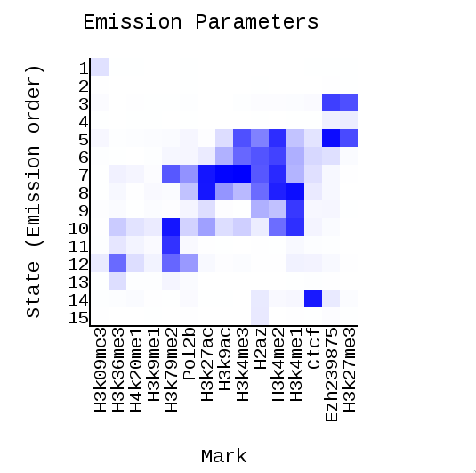
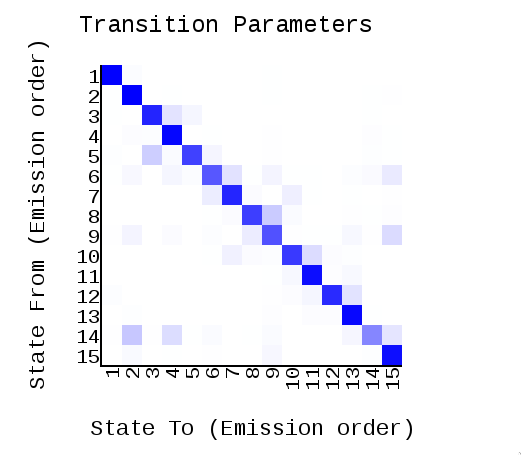
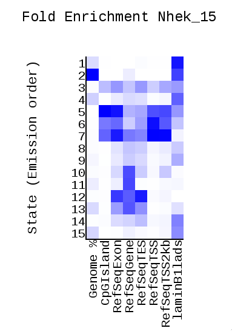
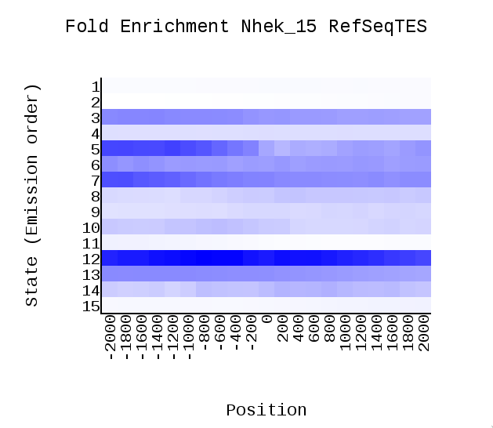
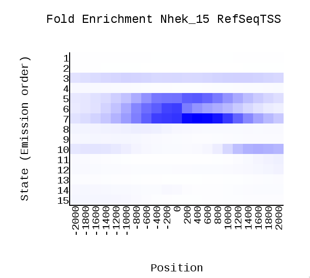
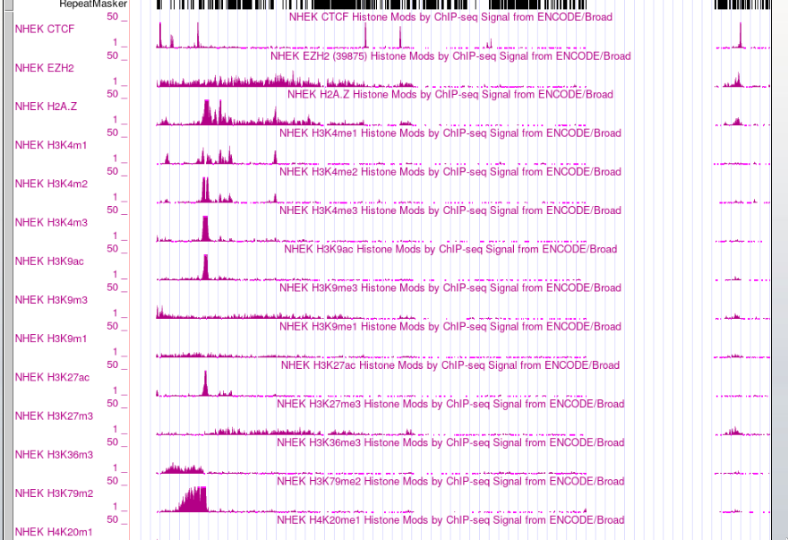

# hse_hw3_chromhmm
hse homework
Работа выполнена в [colab](https://colab.research.google.com/drive/1l4oC6QjOOD4QdfSopr-b1fcfP8Ca0yS-#scrollTo=nltPds4hHPFg) 

Получен результат из model learning [html](./data/webpage_15.html). Остальные полученные файлы неаходятся в [папке data](./data)

Файл [Nhek_15_expanded.bed](Nhek_15_expanded.bed) загружен в genome browser.Получен результат:

