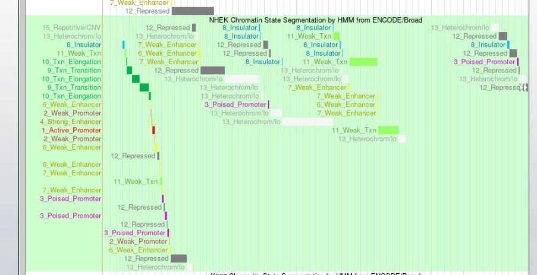

# hse_hw3_chromhmm
Работа выполнена в [colab](https://colab.research.google.com/drive/1l4oC6QjOOD4QdfSopr-b1fcfP8Ca0yS-#scrollTo=nltPds4hHPFg) 

Получен результат из model learning [html](./data/webpage_15.html). Остальные полученные файлы неаходятся в [папке data](./data)

Файл [Nhek_15_expanded.bed](Nhek_15_expanded.bed) загружен в genome browser.

Получен результат:

Полученные данные позволяют предположить:

Промоутерами: H3K4me1 H3K09me3

Энчансерами:  H3K4me1 H3K4me2

Инсулятором: Ctcf

Элонгациями: H3K4me1 H3K9me3 H4K20me1

Транзициями: Ctcf H3k79me2
